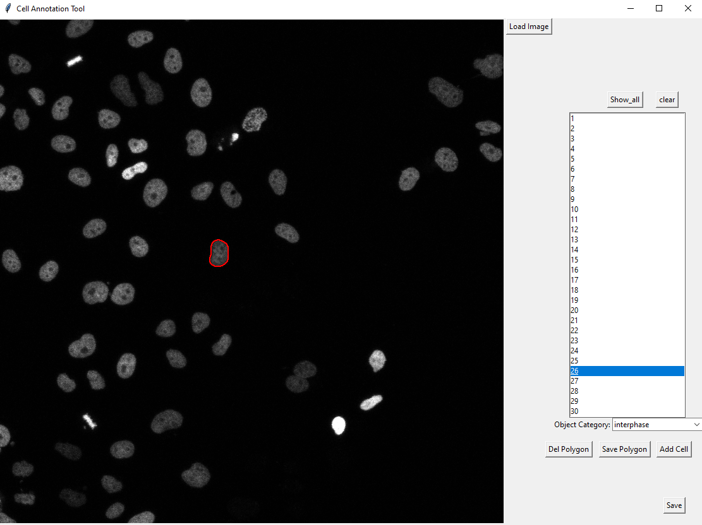
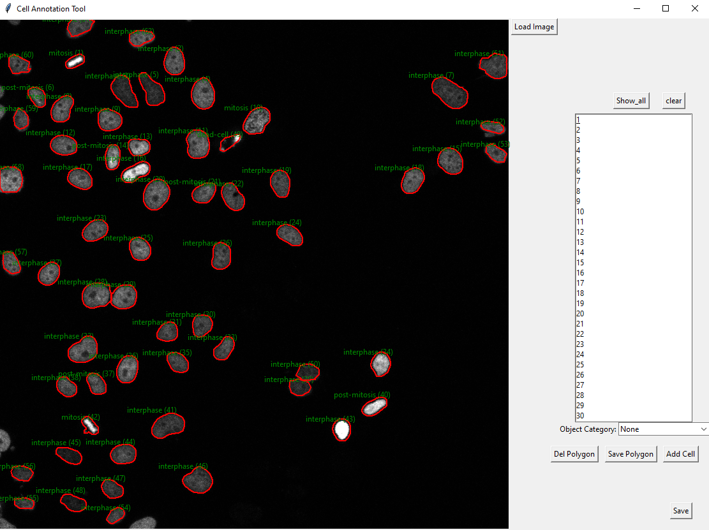

This is a simple python based gui for annotating images like coco dataset. For each image file a .json file is created.

Usage:
If already an annotation exists. Then rename the json file as the same as image name and load the image and the annoataions in the gui will be loaded. (the class category needed to be modified in the gui script for usage in a new dataset.

If an annotation does not exist create a blank annotation by running the script create_blank_annotation.py. Also set the class categories in this script.

1. To add a new annotation.
by clicking one by one on the boundary of the object creates an contour around the object. Then click add cell to add this object into annotation. Then by clicking on the newly added object id, the class of this object can be selected. If in between the created contour is wrong then it can be removed by clicking clear button.

  

2. To change a current annotation
by clicking on the button Del polygon will remove the current annotation polygon of that object and can be create a contour as mentioned above and then click save Polygon to save the new annotation to the same object id

3. TO change the object category class
select the object id from the list and under the list from the dropdown option the cell category can be changed.

4. To display all the current annotation
click on the button show all, it will display all annotations along with its class category and object id.

  

5. To clear all or any contours click the clear button.

6. To save the new annotations after edit or during the edit click on the save button.
